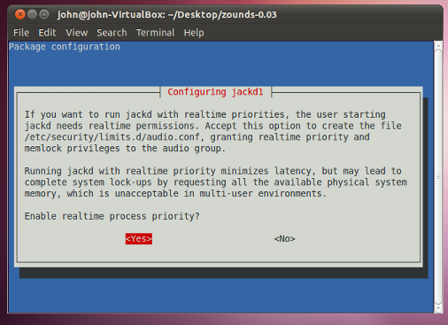

Installation
=================================

=================================
Caveats
=================================
This is a very early release of Zounds. So far, it has only been tested on Ubuntu 10.10.

=================================
Download
=================================
Get the latest source distribution here: `zounds-0.03.tar.gz <https://bitbucket.org/jvinyard/zounds2/downloads/zounds-0.03.tar.gz>`_.
The source distribution is the latest stable release, so this is the preferred way to get Zounds if you're planning to go through the :doc:`quickstart tutorial <quick-start>`, or write a client application.

Or, if you're feeling brave, get the source: `Zounds on BitBucket <https://bitbucket.org/jvinyard/zounds2/src>`_.
 
=================================
Setup.py
=================================
Run::

	sudo python setup.py install

During installation, you'll see something like this:

Be sure to enable realtime scheduling for JACK.

.. NOTE::
	setup.py installs quite a few libraries and Python packages, and may take
	some time to run.

.. WARNING::
	During installation, `scikits.audiolab` causes an error that halts the 
	script.  You can simply re-issue the command above, and things will continue
	along just fine.  It's a bit klunky, but it gets the job done.

=================================
Test Audio
=================================
Zounds uses the `JACK <http://jackaudio.org/>`_ library to play audio.  Setup.py
added the user you're logged in as to the "audio" group, which gives you realtime
audio permissions. **You'll need to log out and back in for these changes to take
effect**. Once you do, run::

	zounds-audio-test.py

You should hear a rhythmic ticking sound. This means that everything is setup
properly.

=================================
Bravo!
=================================
You've succesfully installed zounds! Now on to the :doc:`Quick Start Tutorial </quick-start>`

	

